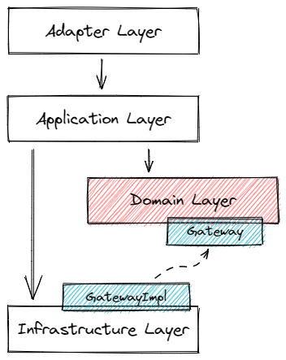

## 应用架构

mcoding 应用层的架构是基于开源的 [COLA 4.0](https://github.com/alibaba/COLA) 架构来开发的（COLA 是 Clean Object-Oriented and Layered Architecture的缩写，代表“整洁面向对象分层架构”）。

应用架构的意义在于定义一套良好的结构；治理应用复杂度，降低系统熵值；从随心所欲的混乱状态，走向井井有条的有序状态。**我们提倡以业务为核心，解耦外部依赖，分离业务复杂度和技术复杂度**。

应用架构的本质，就是要从繁杂的业务系统中提炼出共性，找到解决业务问题的最佳共同模式，为开发人员提供统一的认知，治理混乱。帮助应用系统“从混乱到有序”，核心职责就是定义良好的应用结构，提供最佳实践。

## 分层结构

所有复杂系统都会呈现出层级结构，管理如此，软件设计也不例外，你能想象如果网络协议不是四层，而是一层，意味着你要在应用层去处理链路层的 bit 数据流会是怎样情景吗？同样，**应用系统处理复杂业务逻辑也应该是分层的，下层对上层屏蔽处理细节，每一层各司其职，分离关注点，而不是一个 ServiceImpl 解决所有问题**。

1、适配层（Adapter Layer）：负责对前端展示（web、wireless、wap）的路由和适配，对于传统 B/S 系统来说，adapter 就相当于 MVC 中的 controller。如果需要的话，定时任务调度和发送消息通知等入口也可以放在这一层。

2、应用层（Application Layer）：主要负责获取输入，组装上下文，参数校验，调用领域层做业务处理。层次是开放的，应用层也可以绕过领域层，直接访问基础实施层；

3、领域层（Domain Layer）：主要是封装了核心业务逻辑，并通过领域服务（Domain Service）和领域对象（Domain Entity）的方法对 App 层提供业务实体和业务逻辑计算。领域是应用的核心，不依赖任何其他层次；

4、基础实施层（Infrastructure Layer）：主要负责技术细节问题的处理，比如数据库的 CRUD、搜索引擎、文件系统、分布式服务的 RPC 等。此外，领域防腐的重任也落在这里，外部依赖需要通过 gateway 的转义处理，才能被上面的 App 层和 Domain 层使用。

## 分包结构

前面的分层是属于比较大粒度的职责划分，接下来我们有必要往下再细化到包结构的粒度，这样才能更好的指导我们的工作。

左边的是分层，右边的是分层+分包。分包的目的就是我们经常说的**高内聚**，将功能类似的东西放在一起，这样应用的结构会更加清晰，对于系统的认知成本和维护成本也会有所降低。

各个包结构的简要功能描述，如下表所示：

| 层次 | 包名 | 功能 | 必选 |
|:---:|:----:|:---:|:----:|
| Adapter | web | 处理页面请求的 Controller | 否 |
| Adapter | consumer | 处理外部 Message | 否 |
| Adapter | scheduler | 处理定时任务 | 否 |
| App | executor | 处理 Request，包括 Command 和 Query | 是 |
| App | convertor | 实体转换 | 否 |
| App | event | 事件处理，业务解耦 | 否 |
| Domain | model | 领域模型 | 否 |
| Domain | ability | 领域能力，包括 DomainService | 否 |
| Domain | gateway | 领域网关，解耦利器 | 是 |
| Infra | mapper | 数据库映射 | 否 |
| Infra | config | 配置信息 | 否 |
| Infra | gatewayimpl | 网关实现 | 是 |
| Client SDK | api | 服务对外透出的 API | 是 |
| Client SDK | dto | 服务对外的 DTO | 是 |

!> 这里的分包结构只是示例，除必选的几个包之外，其他的包可以根据项目的实际情况适当调整

## 解耦

在 DDD 中，防腐层（Anti-corruption layer， 简称 ACL）是一个很棒的解耦设计思想，简单说，就是应用不要直接依赖外域的信息，要把外域的信息转换成自己领域上下文（Context）的实体再去使用，从而实现本域和外部依赖的解耦。

在 COLA 架构中，把防腐层这个概念进行了泛化，将数据库、搜索引擎等数据存储都列为外部依赖的范畴。利用依赖倒置，统一使用 gateway 来实现业务领域和外部依赖的解耦。

在架构中的实现方式如下图所示，主要是在 Domain 层定义 Gateway 接口，然后在 Infrastructure 提供 Gateway 接口的实现。

举个例子，假如有一个电商系统，对于下单这个操作，它需要联动订单服务、商品服务、库存服务、营销服务等多个系统才能完成。

那么在订单域，该如何获取商品和库存信息呢？最直接的方式，无外乎就是 RPC 调用商品和库存服务，拿到 DTO 直接使用就完了。

然而，商品域吐出的是一个大而全的 DTO（可能包含几十个字段），而在下单这个阶段，订单所需要的可能只是其中几个字段而已。更合适的做法，应该是在订单域中，使用 gateway 对商品域和库存域的依赖进行解耦。

这样做有两个好处，一个是降低了对外域信息依赖的耦合；另一个是通过上下文映射（Context mapping），确保本领域边界上下文（Bounded context）下领域知识的完整性，实现了统一语言（Ubiquitous language）。
