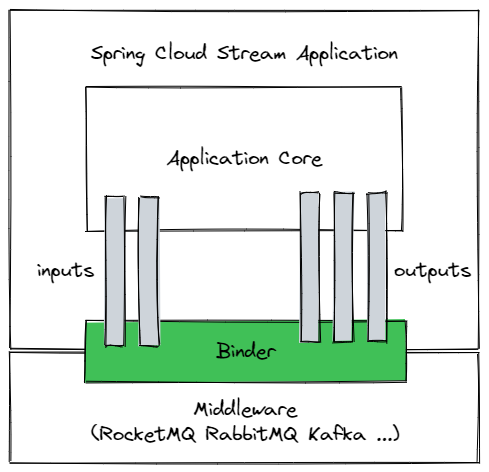

# 消息队列组件

这里我们使用 Spring Cloud Stream + RocketMQ 来实现消息队列组件

Spring Cloud Stream 是一个构建消息驱动微服务的框架，对消息中间件做了进一步的封装，可以做到代码层面对消息中间件的无感知，甚至于动态的切换中间件(RabbitMQ 切换为 RocketMQ 或者 Kafka)，使得微服务开发的高度解耦，更聚焦业务。



从下往上看，Middleware 就是具体的消息中间件，可以是 RocketMQ，也可以是 RabbitMQ，还可以是 Kafka

Binder 是适配器，将 Stream 与中间件连接起来，不同的中间件有不同的 Binder

Application Core 就是由 Stream 封装的消息机制

inputs 相当于消费者 consumer，与Spring Cloud Stream 中的 Binder 交互

outputs 相当于生产者 producer，与Spring Cloud Stream 中的 Binder 交互

## 使用方法

1、在工程的 **Adapter** 模块添加依赖

```xml
<dependency>
    <groupId>cn.mcoding</groupId>
    <artifactId>mcoding-spring-boot-starter-mq</artifactId>
</dependency>
```

2、在工程的 **Start** 模块增加配置内容，配置文件在 `resources/application.yml`

!> 这里演示将生产者和消费者放到了同一个工程，所以配置文件中同时出现生产者和消费者的配置项

```yaml
spring:
  cloud:
    # Spring Cloud Function 定义
    function:
      definition: consumer

    # Spring Cloud Stream
    stream:
      # Spring Cloud Stream Binding - BindingProperties
      bindings:
        # https://docs.spring.io/spring-cloud-stream/docs/3.2.2/reference/html/spring-cloud-stream.html#_binding_and_binding_names
        # 生产者（output 命名规则：<functionName> + -out- + <index>)
        producer-out-0:
          # RocketMQ Topic
          destination: orderly

        # 消费者（input 命名规则：<functionName> + -in- + <index>)
        consumer-in-0:
          # RocketMQ Topic
          destination: orderly
          # 消费者订阅组
          group: orderly-consumer-group

      # Spring Cloud Stream RocketMQ 配置项
      rocketmq:
        binder:
          # RocketMQ Namesrv 地址
          name-server: localhost:9876

        # RocketMQ 自定义 Binding 配置项
        # 配置参考：https://github.com/alibaba/spring-cloud-alibaba/wiki/RocketMQ-en
        # 官方示例：https://github.com/alibaba/spring-cloud-alibaba/blob/2021.x/spring-cloud-alibaba-examples/rocketmq-example/rocketmq-orderly-consume-example/src/main/resources/application.yml
        bindings:
          consumer-in-0:
            consumer:
              # tag: {@code tag1||tag2||tag3 }; sql: {@code 'color'='blue' AND 'price'>100 } .
              # subscription: 'TagA || TagC || TagD'
              push:
                orderly: true
          producer-out-0:
            producer:
              group: output_1
              # 发送信息超时的毫秒数
              sendMessageTimeout: 10000
```

3、编写代码

!> 注意：消息处理的代码需要放到 **Adapter** 模块中，在 controller 中创建 mq 目录

消费者

```java
package cn.mcoding.demo.controller.mq.consumer;

import cn.mcoding.demo.controller.mq.SimpleMsg;
import lombok.extern.slf4j.Slf4j;
import org.springframework.context.annotation.Bean;
import org.springframework.messaging.Message;
import org.springframework.stereotype.Component;

import java.util.List;
import java.util.function.Consumer;

@Component
@Slf4j
public class DemoMessageConsumer {

    @Bean
    public Consumer<Message<List<SimpleMsg>>> consumer(){
        return msg -> {
            log.info("【收到消息】[线程]={}, [消息]={}", Thread.currentThread().getName(), msg.getPayload());
        };
    }

}
```

生产者

```java
package cn.mcoding.demo.controller.mq.provider;

import cn.mcoding.demo.controller.mq.SimpleMsg;
import lombok.extern.slf4j.Slf4j;
import org.springframework.cloud.stream.function.StreamBridge;
import org.springframework.messaging.Message;
import org.springframework.messaging.support.GenericMessage;
import org.springframework.stereotype.Component;

import javax.annotation.Resource;
import java.util.ArrayList;
import java.util.Collections;
import java.util.List;

@Component
@Slf4j
public class DemoMessageProvider {

    @Resource
    private StreamBridge streamBridge;

    public boolean producer() {
        List<SimpleMsg> simpleMsgList = new ArrayList<>();
        SimpleMsg simpleMsg01 = new SimpleMsg("Hello RocketMQ SimpleMsg01");
        SimpleMsg simpleMsg02 = new SimpleMsg("Hello RocketMQ SimpleMsg02");
        SimpleMsg simpleMsg03 = new SimpleMsg("Hello RocketMQ SimpleMsg03");
        Collections.addAll(simpleMsgList, simpleMsg01, simpleMsg02, simpleMsg03);

        Message<List<SimpleMsg>> msg = new GenericMessage(simpleMsgList);
        boolean b = streamBridge.send("producer-out-0", msg);

        log.info("【发送消息】[线程]={}, [发送是否成功]={}", Thread.currentThread().getName(), b);
        return b;
    }

}
```

## 配置说明

这里的配置稍微有点复杂，我们拆解一下大致可以分成三块

1、Spring Cloud Function 的配置

因为 Spring Cloud Stream 3.1.x 的版本弃用了 `@StreamListener`，新版本采用函数式编程方式接入消息中间件，所以消费者接收消息的函数需要先在配置文件中定义，如果有多个用 `;` 分割

```yaml
spring:
  cloud:
    function:
      definition: consumer1;consumer2;consumer3
```

2、Spring Cloud Stream Binding 的配置

Binding 的配置是关键，相当于定义了 Stream 与消息中间件的连接通道

```yaml
spring:
  cloud:
    # Spring Cloud Stream
    stream:
      # Spring Cloud Stream Binding - BindingProperties
      bindings:
        # https://docs.spring.io/spring-cloud-stream/docs/3.2.2/reference/html/spring-cloud-stream.html#_binding_and_binding_names
        # 生产者（output 命名规则：<functionName> + -out- + <index>)
        producer-out-0:
          # RocketMQ Topic
          destination: orderly

        # 消费者（input 命名规则：<functionName> + -in- + <index>)
        consumer-in-0:
          # RocketMQ Topic
          destination: orderly
          # 消费者订阅组
          group: orderly-consumer-group
```

3、Spring Cloud Stream RocketMQ 的配置

这里就是 RocketMQ 的配置项了，除了指定 Namesrv 外，还能自定义 Binding 的配置

```yaml
spring:
  cloud:
    # Spring Cloud Stream
    stream:
      # Spring Cloud Stream RocketMQ 配置项
      rocketmq:
        binder:
          # RocketMQ Namesrv 地址
          name-server: localhost:9876

        # RocketMQ 自定义 Binding 配置项
        # 配置参考：https://github.com/alibaba/spring-cloud-alibaba/wiki/RocketMQ-en
        # 官方示例：https://github.com/alibaba/spring-cloud-alibaba/blob/2021.x/spring-cloud-alibaba-examples/rocketmq-example/rocketmq-orderly-consume-example/src/main/resources/application.yml
        bindings:
          consumer-in-0:
            consumer:
              # tag: {@code tag1||tag2||tag3 }; sql: {@code 'color'='blue' AND 'price'>100 } .
              # subscription: 'TagA || TagC || TagD'
              push:
                orderly: true
          producer-out-0:
            producer:
              group: output_1
              # 发送信息超时的毫秒数
              sendMessageTimeout: 10000
```

?> _TODO_ 这里 sendMessageTimeout 的配置项需要展开说明
