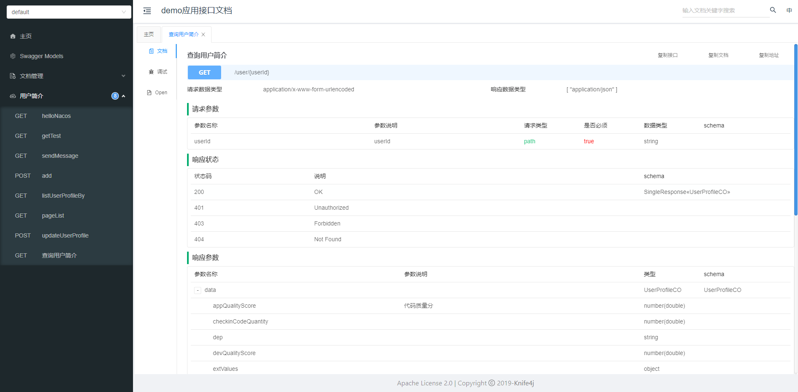
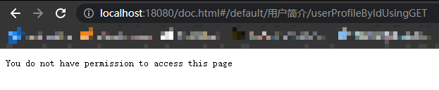

# Swagger 组件

这里封装的 Swagger 组件依赖 knife4j，knife4j 是为 Java MVC 框架集成 Swagger 生成 Api 文档的增强解决方案,前身是 swagger-bootstrap-ui，取名 knife4j 是希望她能像一把匕首一样小巧、轻量、并且功能强悍。

## 使用方法

1、在工程对应的模块添加依赖

```xml
<!-- mcoding 自定义 Swagger 组件 starter -->
<dependency>
    <groupId>cn.mcoding</groupId>
    <artifactId>mcoding-spring-boot-starter-swagger</artifactId>
</dependency>
```

2、在工程的 **Start** 模块增加配置内容，配置文件在 `resources/application.yml`

```yaml
# Swagger 相关配置
swagger:
  # 是否生产模式，默认：false （为防止api信息泄露，建议开启生产模式配置）
  production: true
  title: ${spring.application.name}应用接口文档
  author: mcoding
  version: '@project.version@'
  description: mcoding
  basePackage: cn.mcoding.demo
```

3、编写 Controller 代码，增加 swagger 注解

接口类上的注解

```java
@Api(tags = "用户简介")
public class UserProfileController {
    // ...
}
```

接口方法上的注解

```java
@ApiOperation("查询用户简介")
@GetMapping(value = "/user/{userId}", produces = {MediaType.APPLICATION_JSON_VALUE})
public SingleResponse<UserProfileCO> userProfileById(@PathVariable String userId) {
    UserProfileGetQry qry = new UserProfileGetQry();
    qry.setUserId(userId);
    return userProfileService.getUserProfileBy(qry);
}
```

实体类上的注解

```java
@ApiModel(description = "用户信息实体")
public class UserProfileCO extends ClientObject {
    // ...
}
```

实体属性上的注解

```java
/**
 * 代码质量分
 */
@ApiModelProperty(value = "代码质量分")
private double appQualityScore;
```

这些都是常用的注解，更多详情可以参考官方文档 [Swagger-Core Annotations](https://github.com/swagger-api/swagger-core/wiki/Annotations-1.5.X)

最后访问 http://localhost:8080/doc.html 就能看到项目的接口文档



## 配置说明

```yaml
swagger:
  # 是否生产模式，默认：false （为防止api信息泄露，建议开启生产模式配置）
  production: true
```

!> 这里再强调一下，如果是生产环境一定要将 production 配置为 true

配置为 true 之后的效果

